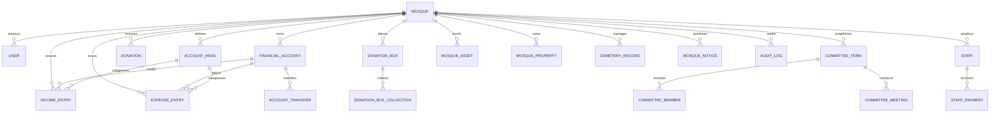

# MasjidLedger Database Architecture & Multi-Tenant Design

This document details the database schemas, entity relationship architecture, multi-tenant data isolation rules, double-entry financial accounting constraints, and persistence storage mechanisms.

---

## 1. Multi-Tenant Architecture & Data Isolation

MasjidLedger implements **Shared Process, Logical Isolation (Tenant-Key Isolation)**:

1. **Tenant Key (`mosqueId`)**:
   - Every single entity in the database (`FinancialAccount`, `AccountHead`, `IncomeEntry`, `ExpenseEntry`, `Donation`, `Staff`, `CommitteeMember`, `MosqueAsset`, `MosqueProperty`, `CemeteryRecord`, `MosqueNotice`, `AuditLog`) is strictly tagged with its parent `mosqueId`.
2. **Middleware Isolation Enforcer**:
   - All read queries (`filter(item => item.mosqueId === req.currentMosque.id)`) and write operations automatically bind to `req.currentMosque.id`.
3. **Role-Based Tenant Access**:
   - `SUPER_ADMIN`: Cross-mosque management authority.
   - `MOSQUE_ADMIN`, `ACCOUNTANT`, `TREASURER`, `COMMITTEE_ADMIN`, `AUDITOR`: Strictly scoped to their home mosque.

---

## 2. Entity Relationship Diagram (ERD)

---

## 3. Financial Integrity & Transaction Rules

### 3.1 Idempotency Key Guard
To prevent duplicate financial vouchers caused by mobile network retries or double-taps:
- The server checks `Idempotency-Key` (UUIDv4) sent by Android/Web clients.
- Processed results are cached in the database's `idempotencyMap`.
- Any matching key within a 24-hour window returns the cached response immediately without creating duplicate accounting entries.

### 3.2 Double-Entry Consistency & Audit Trails
- **Income Voucher (`IncomeEntry`)**: Atomically increments the targeted `FinancialAccount.currentBalance`.
- **Expense Voucher (`ExpenseEntry`)**: Atomically decrements the targeted `FinancialAccount.currentBalance`.
- **Donation Receipt (`Donation`)**: Simultaneously creates a completed Donation record and an auto-approved `IncomeEntry` under the designated account head.
- **Staff Payroll (`StaffPayment`)**: Simultaneously records staff payroll details and auto-posts an approved `ExpenseEntry` under the salary head.
- **Reversals vs Deletions**: Financial entries cannot be hard-deleted. They must be reversed via `POST .../reverse`, which flags the entry as `CANCELLED`, records the reversal reason, debits/credits the account balance back, and logs the change to `AuditLog`.

---

## 4. Entity Specifications

### 4.1 `Mosque`
- `id` (PK, string)
- `code` (Unique shortcode, e.g. `MAMUN-WAQF-01`)
- `nameBn`, `nameEn` (string)
- `waqfEstateName`, `registrationNumber` (string)
- `address`, `phone`, `email`, `website`, `logoUrl`
- `qrSettings`: `{ bkashNumber, nagadNumber, rocketNumber, bankAccountInfo, customQrImageUrl }`
- `createdAt`, `updatedAt`

### 4.2 `FinancialAccount`
- `id` (PK, string)
- `mosqueId` (FK)
- `nameBn`, `name` (string)
- `accountType`: `'CASH' | 'BANK' | 'MFS' | 'OTHER'`
- `bankName`, `branchName`, `accountNumber`
- `openingBalance` (number)
- `currentBalance` (number)
- `status`: `'ACTIVE' | 'INACTIVE'`
- `isDefault` (boolean)

### 4.3 `AccountHead` (Chart of Accounts)
- `id` (PK, string)
- `mosqueId` (FK)
- `code` (string, e.g. `INC-101`, `EXP-201`)
- `nameBn`, `nameEn` (string)
- `type`: `'INCOME' | 'EXPENSE'`
- `parentId` (FK to self or null for top-level root head)
- `isSystem` (boolean)
- `isActive` (boolean)

### 4.4 `IncomeEntry` & `ExpenseEntry`
- `id` (PK, string)
- `mosqueId` (FK)
- `voucherNumber` (string, formatted e.g. `INC-2026-000001` / `EXP-2026-000001`)
- `date` (ISO Date YYYY-MM-DD)
- `mainHeadId`, `mainHeadNameBn` (string)
- `subHeadId`, `subHeadNameBn` (string)
- `amount` (number)
- `paymentMethod`: `'CASH' | 'BANK' | 'BKASH' | 'NAGAD' | 'ROCKET' | 'CARD' | 'ONLINE' | 'OTHER'`
- `accountId`, `accountName` (string)
- `donorName` / `payeeName` (string)
- `reference`, `description`, `attachmentUrl` (string)
- `status`: `'DRAFT' | 'PENDING' | 'APPROVED' | 'CANCELLED'`
- `createdBy`, `createdByName`, `approvedBy`, `approvedByName`
- `rejectionReason` (string)

---

## 5. Storage Engine & Persistence Implementation

1. **Current Storage Engine**:
   - High-performance, file-backed atomic JSON storage engine located at `data/masjidledger_db.json`.
   - On server startup, data is read into indexed memory structures.
   - On every mutation (`save()`), data is atomically written to disk.
2. **Production SQL / Firestore Schema Migration Blueprint**:
   - The architecture and TypeScript interfaces in `src/types/index.ts` map 1:1 to PostgreSQL / Cloud SQL tables (using Drizzle/Prisma) or Firebase Firestore collections.
